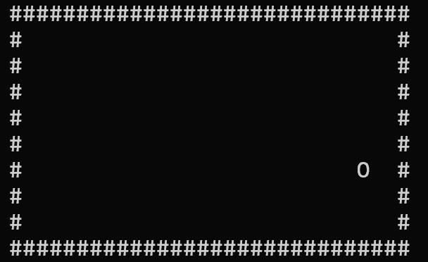

# ACGL - A Certain Graphic Library

ACGL is a lightweight C library designed to create simple text-based graphical interfaces directly in the terminal.

It provides an easy-to-use abstraction of a 2D screen, allowing users to build visual programs such as small games or interactive tools.

## Features

- Initialize a `Screen` instance
- Set a character at a given coordinate `(x,y)`
- Write text to the screen
- Clear the screen with a chosen character
- Render the screen to the terminal
- Draw rectangles (filled or outline)

## Example

```c
Screen *s = screen_create(10, 5);

screen_clear(s, '.');
screen_write(s, 2, 2, "Hello");
screen_drawRect(s, 0, 0, 10, 5, 0,'*');

screen_render(s);
```
Result :


Bouncing ball demo :

```c
Screen *s = screen_create(30, 10);

    int x = 1;
    int y = 1;
    int dx = 1;
    int dy = 1;

    while(1){
        screen_terminalReset();          // clear terminal
        screen_clear(s, ' ');            // clear buffer

        // draw border
        screen_drawRect(s, 0, 0, s->width, s->height, false, '#');

        // draw moving point
        screen_set(s, x, y, 'O');

        // render
        screen_render(s);
        screen_refreshRate(20);

        // update position
        x += dx;
        y += dy;

        // bounce on walls
        if(x <= 1 || x >= s->width - 2) dx = -dx;
        if(y <= 1 || y >= s->height - 2) dy = -dy;
    }

    screen_destroy(s);
    return 0;
```

Result :


