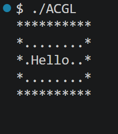

# ACGL - A Certain Graphic Library

ACGL is a lightweight C library designed to create simple text-based graphical interfaces directly in the terminal.

It provides an easy-to-use abstraction of a 2D screen, allowing users to build visual programs such as small games or interactive tools.

## Features

- Initialize a `Screen` instance
- Set a character at a given coordinate `(row, col)`
- Write text to the screen
- Clear the screen with a chosen character
- Render the screen to the terminal
- Draw rectangles (filled or outline)

## Example

```c
Screen *s = screen_create(10, 5);

screen_clear(s, '.');
screen_write(s, 2, 2, "Hello");
screen_drawRect(s, 0, 0, 10, 5, 0);

render_screen(s);


